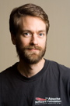
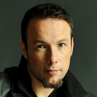
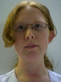

Title: Apache Contributors
license: https://www.apache.org/licenses/LICENSE-2.0

# Current Apache HTTP Server Project Members {#Welcome}

This page exists to recognize the efforts and contributions of the core
individuals in the Apache HTTP Server Project.

| Contributor | Activities |
|-------------|------------|
| **[Erik Abele](#erikabele)** | Mostly documentation, various tweaks here and there |
| **[Aaron Bannert](#aaron)** | Some MPM work, recent APR contributions, "that API guy". |
| **[Brian Behlendorf](#behlendorf)** | Various, focusing on infrastructure for development. |
| **[Rich Bowen](#rbowen)** | Documentation |
| **[Ken Coar](#coar)** | HTML pedant, FAQ editor, UI perfectionist, bugdb script hacker |
| **[Eric Covener](#covener)** | Bug fixes, LDAP, Documentation, IRC and ML support |
| **[Davi Arnaut](#darnaut)** | Bug fixes and others things |
| **[Mark Cox](#cox)** | Cookie module, Status module, DBM code. |
| **[Chris Darroch](#chrisd)** | |
| **[Lars Eilebrecht](#lars)** | Bug hunter |
| **[Stefan Eissing](#icing)** | mod_h2 |
| **[Ralf S. Engelschall](#rse)** | Dr. Cosmetics, mod_rewrite, DSO support, Configure, APACI, apxs, etc. |
| **[Justin Erenkrantz](#jerenkrantz)** | |
| **[Roy T. Fielding](#fielding)** | Standards Cop. |
| **[Tony Finch](#fanf)** | Mass virtual hosting |
| **[Stefan Fritsch](#sf)** | Bug fixes |
| **[Daniel Gruno](#humbedooh)** | Documentation, bug fixes, syntax highlighting |
| **[Rob Hartill](#hartill)** | general trouble maker, comments to offend all. |
| **[Brian Havard](#bjh)** | OS/2 porting. |
| **[Yoshiki Hayashi](#yoshiki)** | Documentation. |
| **[Ian Holsman](#ianh)** | Performance &amp; Scalability |
| **[Rian Hunter](#rhunter)** | mod_smtpd!!! |
| **[Ben Hyde](#bhyde)** | |
| **[Jim Jagielski](#jagielski)** | Porter and general hacks. |
| **[Rainer Jung](#rjung)** | |
| **[Manoj Kasichainula](#kasichainula)** | |
| **[Nick Kew](#niq)** | Applications Support (Filtering, DBD) |
| **[Alexei Kosut](#kosut)** | |
| **[Martin Kraemer](#kraemer)** | EBCDIC Port to BS2000 mainframes. |
| **[Ben Laurie](#laurie)** | SCO and QNX porting, Apache-SSL author, pedant. |
| **[Graham Leggett](#minfrin)** | mod_cache, mod_proxy, mod_ldap, mod_headers |
| **[Rasmus Lerdorf](#lerdorf)** | mod_info, mod_php, mod_php3 |
| **[Jason Lingohr](#jsl)** | Documentation. |
| **[Colm MacCárthaigh](#colm)** | graceful-stop, IPv6 oddities, scalability insanity, trunk testing |
| **[Doug MacEachern](#dougm)** | |
| **[André L. Malo](#nd)** | jack of all trades |
| **[Astrid Malo](#kess)** | Documentation |
| **[Madhusudan Mathihalli](#madhum)** | |
| **[Brian McCallister](#brianm)** | mod_lua |
| **[Aram W. Mirzadeh](#mirzadeh)** | Linux &amp; SCO porting. |
| **[Thom May](#thommay)** | Bug fixes and minor stuff |
| **[Chuck Murcko](#murcko)** | mod_proxy, porting to various OS |
| **[Brad Nicholes](#bnicholes)** | Apache and APR for NetWare |
| **[Victor J. Orlikowski](#orlikowski)** | |
| **[Sameer Parekh](#sameer)** | |
| **[Rüdiger Plüm](#pluem)** | Bug fixes |
| **[Noirin Plunkett](#noirin)** | Documentation |
| **[Dan Poirier](#poirier)** | Bug fixes, doc |
| **[Paul Querna](#querna)** | |
| **[Paul J. Reder](#reder)** | |
| **[David Reid](#reid)** | BeOS MPM and APR code, party animal |
| **[Daniel López Ridruejo](#ridruejo)** | |
| **[William A. Rowe, Jr.](#wrowe)** | WinNT porting and support |
| **[Wilfredo Sánchez](#wsanchez)** | Mac OS porting |
| **[Takashi Sato](#takashi)** | Documentation, Japanese translation and bug fixes |
| **[Joe Schaefer](#joes)** | apreq, site |
| **[Cliff Skolnick](#skolnick)** | Solaris porting. |
| **[Marc Slemko](#slemko)** | Security, networking issues |
| **[Joshua Slive](#slive)** | Documentation |
| **[Greg Stein](#stein)** | For now: general pest. Future: WebDAV integration. |
| **[Tony Stevenson](#pctony)** | Documentation |
| **[Bill Stoddard](#stoddard)** | |
| **[Sander Striker](#striker)** | Memory management, enforcing Apache code style |
| **[Paul Sutton](#sutton)** | Documentation writing, code hacking, bug fixing |
| **[Randy Terbush](#terbush)** | Board member, Treasurer, Fund Raiser |
| **[Jeff Trawick](#trawick)** | Bug fixing |
| **[Dirk van Gulik](#vangulik)** | |
| **[Cliff Woolley](#jwoolley)** | |

# Apache Emeritae (old group members now off doing other things) #

| Contributor | Activities |
|-------------|------------|
| **[Ryan Bloom](#bloom)** | APR and initial work to hybridize Apache. Numerous bug fixes and enhancements in the 2.0.x series. Created the Perchild MPM, a lot of work on the filter architecture. |
| **[Dean Gaudet](#dgaudet)** | Performance freak. Numerous bug fixes, and stability enhancements in the 1.x series. Created the MPM architecture. |
| **[Brian Pane](#brianp)** | Performance and scalability |
| **[David Robinson](#robinson)** | Patch database, documentation. |
| **[Robert Thau](#thau)** | Designed and implemented module API, did server core overhaul, process pool model, content negotiation, lots and lots of other stuff. |
| **[Andrew Wilson](#wilson)** | |

# Other major contributors #

| Contributor | Activities |
|-------------|------------|
| **[Howard Fear](#fear)** | SSI extensions. |
| **Florent Guillaume** | Language Negotiation |
| **Koen Holtman** | Rewrite of mod_negotiation |
| **Kevin Hughes** | Creator of all those nifty icons |
| **Brandon Long and Beth Frank** | NCSA Server Development Team, post-1.3 |
| **Ambarish Malpani** | Beginning of the NT port |
| **Rob McCool** | Original author of NCSA httpd 1.3 |
| **Paul Richards** | Convinced the group to use remote CVS after 1.0 |
| **[Garey Smiley](#smiley)** | OS/2 port. |
| **Henry Spencer** | Author of the regex library |

Hundreds of people have made individual contributions to the Apache
project. Patch contributors are listed in the src/CHANGES file. Frequent
contributors have included Petr Lampa, Tom Tromey, James H. Cloos Jr., Ed
Korthof, Nathan Neulinger, Jason S. Clary, Jason A. Dour, Michael Douglass,
Brian Havard, Tony Sanders, Brian Tao, Michael Smith, Adam Sussman, Nathan
Schrenk, Matthew Gray, and John Heidemann.

# Descriptions #

![[photo]](../images/erik.jpg "")  
**Name:** Erik Abele {#erikabele}  
**Organization:** Independent  
**Occupation:** Technology Consultant, Web Developer  
**Location:** Aalen, Germany  
**Comments:** Vogon Heavy Industries - coding with impact!  
**OS Expertise:** Linux, Mac OS X  
**Contributions:** Mostly documentation, various tweaks here and there  

**Name:** Aaron Bannert {#aaron}  
**URL:** [http://www.clove.org/~aaron/](http://www.clove.org/~aaron/)  
**Organization:** [Codemass, Inc.](http://www.codemass.com/)  
**Occupation:** Open Source Software Consultant  
**Location:** San Francisco, CA, USA  
**Comments:** Banish all tabs!  
**OS Expertise:** Linux and Solaris with a dash of Darwin  
**Contributions:** Flood. Various APIs for APR. Some work on the Worker MPM. Threads, mutexes, condition variables, oh my! Interested in various forms of IPC. Terrible m4/autoconf/libtool hacks.  

**Name:** Brian Behlendorf {#behlendorf}  
**URL:** [http://www.behlendorf.com](http://www.behlendorf.com/)  
**Occupation:** CTO  
**Location:** San Francisco, CA, USA  
**Comments:** Infrastructure, baby!  
**OS Expertise:** FreeBSD  
**Contributions:** Various, focusing on assisting the development process itself.  

**Name:** Ryan Bloom {#bloom}  
**Organization:** Independent  
**Occupation:** Software Engineer  
**Location:** Oakland, CA  
**OS Expertise:** Linux, AIX, Windows  
**Contributions:** Apache Portable Run-Time. Initial work to make Apache a hybrid model.  

	  
**Name:** Rich Bowen {#rbowen}  
**URL:** [http://drbacchus.com/](http://drbacchus.com/)  
**Organization:** Red Hat  
**Occupation:** Community Manager  
**Location:** Lexington, KY  
**Comments:** The documentation can always be made just a little better.  
**Contributions:** Documentation. IRC tech support.  

![[photo]](../images/coar.gif "")  
**Name:** Ken Coar {#coar}  
**Organization:** IBM Corporation  
**Occupation:** Software &amp; Web development  
**Location:** Research Triangle Park, North Carolina, USA  
**Comments:** HTML pedant, FAQ editor, UI perfectionist, bugdb script hacker  
**OS Expertise:** Digital UNIX, OpenVMS, Linux (RedHat)  
**Contributions:** The 1.2 example API module, moderately updated FAQ, mod_autoindex and mod_speling enhancements, conditional logging, various minor bug fixes and documentation corrections. Eminently capable of writing code that will Rule The World by consuming resources - but in an elegant way.  

**Name:** Eric Covener {#covener}  
**Organization:** IBM  
**Occupation:** Apache developer  
**Location:** Research Triangle Park, NC, USA  

**Name:** Davi Arnaut {#darnaut}  
**Organization:** [MySQL](http://www.mysql.com/)  
**Occupation:** Software Engineer  
**Location:** Curitiba, PR, Brazil  
**OS Expertise:** Linux, Unix, Windows, others.  

**Name:** Mark Cox {#cox}  
**URL:** [http://www.awe.com/mark/](http://www.awe.com/mark/)  
**Organization:** Red Hat, Inc.  
**Occupation:** Director of Engineering  
**Location:** England  
**Contributions:** Various patches, bug fixes, and DBM code alterations bringing Apache in line with what we were using on www.telescope.org. Cookie module. Server Status module. Editor of [Apache Week](http://www.apacheweek.com/)  

**Name:** Chris Darroch {#chrisd}  
**Organization:** Pearson Education Core Technology Group  
**Occupation:** System Architect  
**Location:** British Columbia, Canada  

**Name:** Lars Eilebrecht {#lars}  
**URL:** [http://www.eilebrecht.net/](http://www.eilebrecht.net/)  
**Occupation:** Freelance IT Consultant  
**Location:** Munich, Germany  
**Contributions:** Bugs, bug fixes, documentation, etc.  

  
**Name:** Stefan Eissing {#icing}  
**URL:** [http://eissing.org/](http://eissing.org/)  
**Organization:** greenbytes GmbH  
**Occupation:** Coder + Founder  
**Location:** Münster, Germany  
**OS Expertise:** Linux, OS X  
**Contributions:** mod_h2, some core patches  

**Name:** Ralf S. Engelschall {#rse}  
**URL:** [http://www.engelschall.com/](http://www.engelschall.com/)  
**Organization:** Private  
**Occupation:** Cable &amp; Wireless Deutschland GmbH  
**Location:** Munich, Germany  
**Contributions:** Contributor of the *URL Rewriting Module* (mod_rewrite), the *Dynamic Shared Object* (DSO) support, the *Apache Autoconf-style Interface* (APACI), the overhauling of the Configure script and Makefile templates and various bugfixes and minor features: *Line Continuation* for config files, programs for the *Big Symbol Renaming* in April 1998 (foo -&gt; ap_foo), Reverse Proxy support, etc. In general Ralf is *Dr. Cosmetics* at the Apache Group because his opinion is that every type of hacking is some sort of art and hence needs to be maximum clean and perfect.  

**Name:** Justin Erenkrantz {#jerenkrantz}  
**URL:** [http://www.erenkrantz.com/](http://www.erenkrantz.com/)  
**Occupation:** Graduate Student  
**Location:** Irvine, California  
**Contributions:** Justin does anything that he thinks needs to be done. He's also to blame for httpd-mbox and flood (in httpd-test).  

**Name:** Howard Fear {#fear}  
**Organization:** NetPlus+, RedCape Policy Software, Inc.  
**Occupation:** Everything software  
**Location:** Colorado  
**Comments:** The story teller makes no choice. Soon you will not hear his voice. His job is to shed light, and not to master.  
**Contributions:** SSI extensions and occasional bug fixes  

**Name:** Roy T. Fielding {#fielding}  
**URL:** [http://roy.gbiv.com/](http://roy.gbiv.com/)  
**Occupation:** Chief Scientist  
**Location:** Irvine, California  
**Contributions:** Roy is the standards cop. He keeps the group informed of changes to the standards for HTTP, HTML and URI, and makes sure that Apache conforms to those worth conforming to. On a good day, he'll even test the code, dabble in software engineering practice, submit a few patches, and squeeze out an agenda.  

**Name:** Tony Finch {#fanf}  
**Organization:** Covalent Technologies  
**Occupation:** Software Engineer  
**Location:** London  
**Contributions:** Simplified mass virtual hosting  

**Name:** Stefan Fritsch {#sf}  
**Organization:** GeNUA mbH  
**Occupation:** System Engineer, Developer  
**Location:** Munich, Germany  
**Contributions:** Bug fixes  

**Name:** Dean Gaudet {#dgaudet}  
**URL:** [http://arctic.org/~dean/](http://arctic.org/~dean/)  
**Occupation:** Member of the Technical Staff  
**Location:** San Francisco, CA, USA  
**Comments:** Performance freak.  
**OS Expertise:** Linux  
**Contributions:** Performance/reliability coding, and general bug fixes. Believes in the One True Tab Width of 8 columns. Known to be a hard-nosed pain in the butt.  

**Name:** Matthew Gray {#gray}  
**URL:** [http://www.mit.edu/~mkgray/](http://www.mit.edu/~mkgray/)  
**Organization:** MIT  
**Occupation:** Research Assistant  
**Location:** Cambridge, MA, USA  
**Contributions:** NCSA1.4 logging compatibility modules, miscellaneous patches  

**Name:** Rob Hartill {#hartill}  
**Organization:** Los Alamos National Laboratory &amp; Internet Movie Database.  
**Occupation:** Post-doc PERL guru  
**Location:** Los Alamos, New Mexico, Good Old US of A  
**Comments:** write it in PERL  

**Name:** Brian Havard {#bjh}  
**URL:** [http://silk.apana.org.au](http://silk.apana.org.au)  
**Occupation:** Software Engineer  
**OS Expertise:** OS/2  
**Location:** Melbourne, Australia  
**Contributions:** Maintenance of [OS/2 port](http://silk.apana.org.au/apache/)  

**Name:** Yoshiki Hayashi {#yoshiki}  
**Organization:** University of Tokyo  
**Occupation:** Graduate Student  
**OS Expertise:** Linux  
**Location:** Tokyo, Japan  
**Contributions:** Documentation, Japanese translation.  

**Name:** Ian Holsman {#ianh}  
**URL:** [http://www.doitwithdata.com.au](http://www.doitwithdata.com.au)  
**Occupation:** Consultant.  
**OS Expertise:** Solaris/Linux/W2K  
**Location:** San Francisco, USA  
**Contributions:** Atomics, mod_deflate, mod_bucketeer  

**Name:** Rian Hunter {#rhunter}  
**Occupation:** Student  
**OS Expertise:** FreeBSD, Mac OS X, Linux  
**Location:** Cambridge, Massachusetts  
**Contributions:** mod_smtpd!!!  

**Name:** Ben Hyde {#bhyde}  
**Occupation:** Principle Engineer  
**Location:** Cambridge, Massachusetts  
**Comments:** Beware of antinomian mysticism  

**Name:** Jim Jagielski {#jagielski}  
**URL:** [http://www.jaguNET.com/jim.html](http://www.jaguNET.com/jim.html)  

**Organization:** [jaguNET Access Services, LLC](http://www.jaguNET.com/)  
**Occupation:** ISP and Web Hosting/Design firm  
**Location:** Forest Hill, Maryland, USA  
**OS Expertise:** MacOS/Darwin, FreeBSD and various SysV flavors  
**Contributions:** Stuff in 1.3, 2.0 and APR, various fixes/hacks and lately coordinating the Releases for 1.3. General porter, coder and trouble maker. Plays "devil's advocate" a bit too often`:-)`  

**Name:** Rainer Jung {#rjung}  
**Organization:** [kippdata informationstechnologie GmbH](http://www.kippdata.de/)  
**Occupation:** Web System Engineer  
**Location:** Bonn, Germany  
**OS Expertise:** Solaris and Linux  
**Contributions:** Fixes and tweaks  

**Name:** Manoj Kasichainula {#kasichainula}  
**Organization:** Collab.Net  
**Occupation:** Senior Software Developer  
**Location:** San Francisco, CA, USA  
**OS Expertise:** Linux, various Unixes  
**Contributions:** Initial pthread hybrid server work, Dexter MPM, 2.0 status API, other 2.0 stuff, arguing with Ryan  
**Comments:** I am the one responsible for killing children with a pipe.  

**Name:** Nick Kew {#niq}  
**Organization:** [WebÞing](http://www.webthing.com/)  
**Occupation:** Development, Consultancy  
**Location:** L-space. Or southwest England.  
**OS Expertise:** Unix-family, including Linux.  
**Contributions:** DBD Architecture; Smart Filtering; Proxy hacks; Documentation; modules, applications and tutorials.  
**Name:** Alexei Kosut {#kosut}  

**Organization:** Stanford University  
**Occupation:** Student  
**Location:** Stanford, California  
**Contributions:** Introduces a lot of bugs someone else has to fix: Initial support for keepalive, HTTP/1.1, name-based virtual hosts. Original author of mod_actions, mod_digest, mod_isapi, mod_jserv, mod_proxy, mod_speling. Partly at fault for the Win32 port. Apparently really likes free T-shirts.  

**Name:** Martin Kraemer {#kraemer}  
**Occupation:** Software Development Engineer  
**Location:** Munich, Germany  
**Comments:** I like portable code that's easily understood.  
**Contributions:** Various proxy patches, the BS2000 EBCDIC port, SVR4 patches  

**Name:** Ben Laurie {#laurie}  
**URL:** [http://www.algroup.co.uk/](http://www.algroup.co.uk/)  
**Organization:** A.L. Digital Ltd  
**Occupation:** Freelance Consultant and Technical Director  
**Location:** London, England  
**OS Expertise:** SCO, QNX, SGI, Windows (all flavours), DOS  
**Contribution:** Apache-SSL, extensive debate on escaping characters, and the odd bug fix.  
**Comments:** What am I doing here?  

**Name:** Graham Leggett {#minfrin}  
**Occupation:** Freelance Consultant / Multiple Hat Wearer  
**Location:** London, England  
**OS Expertise:** Linux, Solaris  
**Contribution:** Designed mod_cache, hacked and chopped on mod_proxy, mod_ldap and mod_headers for v2.0. Designed mod_auth_form and the mod_session suite, the BUFFER and DATA filters, and the mod_relector mechanism. Bugfixing and HTTP caching protocol compliance.  
**Comment:** No comment.  

**Name:** Rasmus Lerdorf {#lerdorf}  
**Company:** IBM Corporation  
**Occupation:** Senior Software Engineer  
**Location:** Research Triangle Park, NC  
**OS Expertise:** Solaris, Linux  
**Contribution:** Wrote mod_info module included in the distribution, as well as mod_php which is available separately from [www.php.net](http://www.php.net).  

**Name:** Jason Lingohr {#jsl}  
**Occupation:** Networks &amp; security Engineer  
**Location:** Melbourne, Australia  
**OS Expertise:** *BSD, Linux, Cisco IOS/networking OSs  
**Contributions:** Documentation.  

**Name:** Daniel López Ridruejo {#ridruejo}  
**Location:** San Francisco, CA, USA  
**Contributions:** Comanche  

**Name:** Colm MacCárthaigh {#colm}  
**Organization:** [HEAnet](http://www.heanet.ie/)  
**Occupation:** Senior Network Engineer  
**Location:** Dublin, Ireland  
**Contributions:** Graceful stop, random IPv6 things, insane scalability experiments  

**Name:** Doug MacEachern {#dougm}  
**Occupation:** Senior Software Engineer  
**Location:** San Francisco, CA, USA  
**Contributions:** [mod_perl](http://perl.apache.org/) , various API additions  

**Name:** André L. Malo {#nd}  
**Occupation:** Yes.  
**Location:** Saarbrücken, Germany  
**Comments:** Always looking for a better dictionary.  
**Contributions:** Documentation, some modules, hacks here and there, code cleanups and bug shaking.  

![[photo]](../images/kess.gif "")  
**Name:** Astrid Malo {#kess} (a.k.a. Kess)  
**URL:** [http://www.kess-net.de/](http://www.kess-net.de/)  
**Occupation:** Software Developer  
**Location:** Saarbrücken, Germany  
**Comments:** Too much projects, too less time.  
**Contributions:** Documentation, German translation  

**Name:** Madhusudan Mathihalli {#madhum}  
**Organization:** Hewlett Packard Company  
**Occupation:** Software Engineer  
**Location:** Cupertino, CA  

**Name:** Brian McCallister {#brianm}  
**URL:** [http://skife.org/](http://skife.org/)  
**Organization:** Ning  
**Occupation:** Programmery Kind of Person  
**Location:** Menlo Park, CA  

**Name:** Aram W. Mirzadeh {#mirzadeh}  
**Comment:** To err is human, to really screw up you need a computer.  
**OS Expertise:** Linux &amp; SCO  

**Name:** Thom May {#thommay}  
**Organisation:** [The Positive Internet Company Ltd](http://www.positive-internet.com/)  
**Occupation:** Systems Administrator and Programmer  
**Location:** London, UK  
**OS Expertise:** Linux. With some OS X on the side.  

![[photo]](../images/chuck.jpg "")  
**Name:** Chuck Murcko {#murcko}  
**URL:** [http://www.topsail.org/](http://www.topsail.org/)  
**Organization:** Topsail Group  
**Occupation:** Grinder  
**Location:** Sedona AZ USA  
**Comments:** Tinkero ergo sum  
**OS Expertise:** UnixWare, IRIX (secondarily) FreeBSD, BSDI, Solaris  

**Name:** Brad Nicholes {#bnicholes}  
**Occupation:** Senior Software Engineer  
**Organization:** [Novell, Inc.](http://www.novell.com)  
**OS Expertise:** NetWare  
**Location:** Provo, Ut. USA  
**Contributions:** Apache 1.3, 2.0 and APR for NetWare  

**Name:** Victor J. Orlikowski {#orlikowski}  
**Organization:** IBM  
**Occupation:** DSO wrangling, BSF rustling, cat herding  
**Location:** Durham, NC USA  
**Comments:** Script? What script?  
**OS Expertise:** Linux, AIX  

**Name:** Brian Pane {#brianp}  
**URL:** [http://www.brianp.net/](http://www.brianp.net/)  
**Location:** Seattle, WA, USA  
**Contributions:** performance and scalability work  

**Name:** Sameer Parekh {#sameer}  
**Organization:** C2Net Software, Inc.  
**Occupation:** Management (whee)  
**Location:** Oakland, CA, USA  
**Contribution:** Bugfixes, documentation, website, administrative/legal, various binary builds as needed  

**Name:** Rüdiger Plüm {#pluem}  
**Organization:** [Vodafone](https://www.vodafone.com/)  
**Occupation:** IT Cloud Infrastructure Engineer  
**Location:** Ratingen, Germany  
**Comments:** Is it a bug or a feature?  
**Contributions:** Bug fixes  
**OS Expertise:** Linux  

  
**Name:** Noirin Plunkett {#noirin}  
**Organization:** Trinity College, Dublin  
**Occupation:** Student  
**Location:** Munich, Germany  
**Comments:** "Yes, but it's no good if no one can understand it!"  
**Contributions:** Documentation  

**Name:** Dan Poirier {#poirier}  
**Organization:** [IBM](http://www.ibm.com/)  
**Occupation:** Programmer  
**Location:** Research Triangle Park, NC, USA  
**OS Expertise:** Linux, Mac OS X  

**Name:** Paul Querna {#querna}  
**Organization:** [Rackspace Hosting](http://www.rackspace.com/)  
**Occupation:** Architect  
**Location:** San Francisco, CA, USA  
**OS Expertise:** FreeBSD, Linux  

**Name:** Paul J. Reder {#reder}  
**Organization:** IBM Corp.  
**Occupation:** Programmer, Software Engineer, Coder, hacker, whatever...  
**Location:** Research Triangle Park, NC, USA  
**OS Expertise:** Linux, Unix, OS/2, others.  

**Name:** Paul Richards {#richards}  
**Organization:** Bluebird Computer Systems. FreeBSD core team member.  
**Location:** UK  
**OS Expertise:** FreeBSD  

**Name:** William A. Rowe, Jr. (a.k.a. wrowe, OtherBill) {#wrowe}  
**Organization:** SpringSource Division of VMware  
**Occupation:** Software Architect; Development and Integration  
**Location:** Gurnee, IL, US  
**Contributions:** Bashing on the Win32 Apache kernel for fun and profit.  

**Name:** Wilfredo Sánchez {#wsanchez}  
**Organization:** Independent  
**Occupation:** Software Engineer  
**Location:** San Jose, CA, USA  
**OS Expertise:** Mac OS X, *BSD  
**Contribution:** Mac OS X port, build fixes.  

**Name:** Takashi Sato {#takashi}  
**Location:** Tokyo, Japan  
**Contribution:** Documentation, Japanese translation and bug fixes  

**Name:** David Robinson {#robinson}  
**Organization:** University of Cambridge  
**Occupation:** Astronomer  
**Location:** Cambridge, UK  

**Name:** Cliff Skolnick {#skolnick}  
**Organization:** steam.com  
**Occupation:** Network/Unix Consultant  
**Location:** San Francisco, CA, USA  
**OS Expertise:** Solaris, *BSD  

**Name:** Marc Slemko {#slemko}  
**Occupation:** Software Engineer / General Irritant  
**Location:** Seattle, WA, USA  
**Contributions:** Security patches, bug hunting and debugging of networking issues.  
**OS Expertise:** *BSD, Solaris, Linux  

**Name:** Joshua Slive {#slive}  
**URL:** [http://slive.ca/](http://slive.ca/)  
**Location:** Montreal, Quebec, Canada  
**Contributions:** Documentation  

**Name:** Garey Smiley {#smiley}  
**Organization:** SoftLink Services  
**Occupation:** Consultant in cross platform applications and web development.  
**Location:** Akron, Ohio USA  
**Comments:** If you can't do UNIX do OS/2.  
**OS Expertise:** OS/2, Win32s, Windows NT, and UNIX.  
**Contributions:** OS/2 port of Apache.  

![[photo]](../images/stein.jpg "")  
**Name:** Greg Stein {#stein}  
**Occupation:** Non-employed Open Source Developer  
**Location:** Palo Alto, CA, USA  
**OS Expertise:** Linux  
**Comments:** [Python](http://www.python.org/) rules!  
**Contributions:** Minor tweaks and fixes. Code review. One day, I'll join the Big Boys.  

![[photo]](../images/pctony.jpg "")  
**Name:** Tony Stevesnon {#pctony}  
**Organization:** ihotdesk Ltd  
**Occupation:** Network Security, and Messaging Specialist  
**Location:** Cambridge, UK  
**OS Expertise:** Windows  
**Comments:** #Apache is scary sometimes  
**Contributions:** Documentation and Support.  

**Name:** Bill Stoddard {#stoddard}  
**URL:** [http://www.software.ibm.com/webservers/](http://www.software.ibm.com/webservers/)  
**Organization:** IBM Corp.  
**Occupation:** Software Development Engineer  
**Location:** Research Triangle Park, NC, USA  
**OS Expertise:** AIX, Windows NT  

**Name:** Sander Striker {#striker}  
**Occupation:** Software Developer  
**Location:** Utrecht, The Netherlands  
**OS Expertise:** Linux, Win32  
**Comments:** Code in style...  
**Contributions:** Work on APR (pools). Code review.  

**Name:** Paul Sutton {#sutton}  
**URL:** [http://www.awe.com/~paul/](http://www.awe.com/~paul/)	  
**Location:** Seattle, USA  
**Comments:** I like documenting things, I really do. Why are you wearing white suits?  
**Contributions:** Long time Apache convert (fixed a bug in version 0.5.2). Actually likes documentation and commenting source. Contributions include some content negotiation stuff, various bug fixes and testing, mod_headers, multiple log files, options +/-. Edited [Apache Week](http://www.apacheweek.com/) until 1999.  

**Name:** Randy Terbush {#terbush}  
**Organization:** Tribal Knowledge Group  
**Occupation:** Independent Consultant  
**Location:** Alta, WY, USA  
**OS Expertise:** UNIX  

**Name:** Robert Thau {#thau}  
**Organization:** MIT Artificial Intelligence Lab  
**Occupation:** grad student &amp; random hacker  
**Location:** Boston, Mass., USA  
**Contributions:** Designed the module interface, and the internal data structures which support it, and adapted the first (and somewhat less than perfect ;-) versions of the modules providing functionality equivalent to Apache 0.6, starting from an early version of Rob Hartill's 0.7 work. Also designed and wrote large portions of the current server core from scratch (alloc.c, http_config.c, http_core.c, and portions of other files), again adapting the rest from 0.7, to produce the first versions of what became Apache 0.8/1.0 (then called Shambhala), after further work by the rest of the group. Various other contributions include the original Apache 0.6 content negotiation code, the SpareServers machinery (for better or worse), the experimental (as of 0.8/1.0) dld module and LogFormat support, and the 0.8/1.0 Configuration script.  

**Name:** Jeff Trawick {#trawick}  
**Organization:** Emptyhammock  
**Occupation:** Software developer  
**Location:** Raleigh, NC, USA  

**Name:** Dirk-Willem van Gulik {#vangulik}  
**Organization:** WebWeaving Consultancy  
**Occupation:** Internet consultant/contractor  
**Location:** [Sunny Italy](http://www.ceo.org/geotool/newserver/centeurmap/centeurdisp.pl?156,242)  
**Contributions:** Full time web development for various remote sensing related projects; playing around with mSQL and Cookies access control for apache (and wu-ftpd). Dreamt up the silly anonymous scheme to allow user tracking which works with almost any client. Like to play around with the language tags.  
**Comments:** But still prefer walking and sailing in this beautiful part of Europe.  

**Name:** Andrew Wilson {#wilson}  
**Organization:** REED Elsevier Science  
**Occupation:** Internet Consultant  
**Location:** Oxford, UK  
**Comments:** I'm really looking forward to this hangover.  

**Name:** Cliff Woolley {#jwoolley}  
**Organization:** University of Virginia  
**Occupation:** Graduate Student  
**Location:** Charlottesville, VA  
**Contributions:** bugfixes, occasional API work  

----------
### And a special thanks to [Rob McCool](http://www.robm.com/) and the team at NCSA for the original httpd source code, which provided a solid base for Apache's development.
